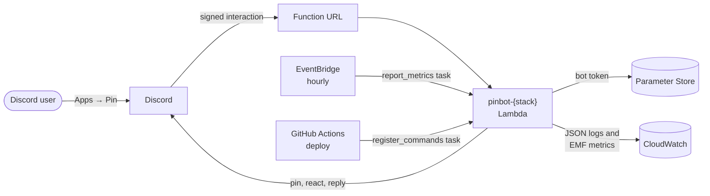
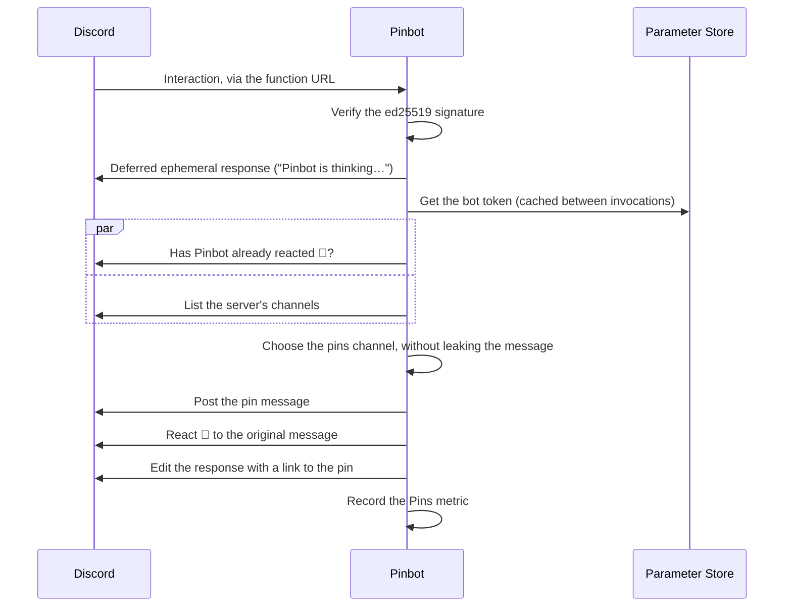
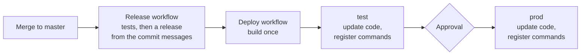

# 📌 Pinbot ƛ

> [!TIP]
> This is a fork of https://github.com/elliotwms/pinbot, rewritten to support being run as an AWS Lambda function

[Install 📌](https://discord.com/oauth2/authorize?client_id=921554139740254209&permissions=3136&redirect_uri=https%3A%2F%2Fgithub.com%2Felliotwms%2Fpinbot&scope=applications.commands%20bot)

[Join the Pinbot Discord Server](https://discord.gg/a3u2PZ6V28)

Whenever you use the bot's "Pin" command (right-click a message, choose Apps, choose Pin), Pinbot posts the message to a channel.

Pinbot will reply with a link to the pinned message, and signal it's done by reacting to the original message with a 📌 emoji.

### Why does this exist?

Pinbot is designed as an extension to Discord's channel pins system. Use Pinbot to:
* Bypass Discord's 50-pin limit and create a historic stream of all your pins
* Collect all your server's pins into one place (with optional overrides)
* Give your server's pins a more permanent home

Discord guilds use pins for a lot more than just highlighting important information. In fact, many guilds use the pin system as a form of memorialising a good joke, a savage putdown, or other memorable moments. As a result, the 50 pin per channel limit means that in order to keep something, you will eventually have to get rid of something else.

### How does it work?

Pinbot uses the channel name to decide where it will post. In order of priority it will pin in:
1. `#{channel}-pins`, where `channel` is the name of the channel the message was pinned in
2. `#pins`, a general pins channel
3. `#{channel}`, the channel the pin was posted in, so that if you don't want a separate pins channel you can instead 
search for pins by @pinbot in the channel

Pins from threads use the thread's parent channel to find a pins channel, and fall back to the thread itself.

To avoid leaking messages to a wider audience, Pinbot skips a pins channel if:
* the message is from an age-restricted (NSFW) channel and the pins channel is not age-restricted, or
* the message is from a private thread, or a channel hidden from `@everyone`, and the pins channel is not also hidden from `@everyone`

Don't forget that Pinbot needs [permission](#permissions) to see and post in these channels, otherwise it won't be able to do its job.

⚠️ Note that this bot is currently in [_beta_](https://github.com/elliotwms/pinbot/milestone/2). There may be bugs, please [report them](https://github.com/elliotwms/pinbot/issues/new?labels=bug&template=bug_report.md) ⚠️

### How does it _really_ work? Like, under the hood

Pinbot is an AWS Lambda function behind a public [function URL](https://docs.aws.amazon.com/lambda/latest/dg/urls-configuration.html), which Discord sends [interactions](https://discord.com/developers/docs/interactions/overview) to. It's built on [bot-lambda](https://github.com/elliotwms/bot-lambda), and its infrastructure is in [infra-pinbot](https://github.com/elliotwms/infra-pinbot).

When someone uses the Pin command:

Pinbot also handles **tasks**: invocations that come from AWS rather than Discord, with a payload like `{"task":"register_commands"}`. Only callers allowed to invoke the function directly can run them; requests through the function URL are never treated as tasks.

| Task                | Run by                                       | What it does                                                         |
|---------------------|----------------------------------------------|----------------------------------------------------------------------|
| `register_commands` | The Deploy workflow, after each deploy        | Registers the commands defined in code (`handlers.PinCommand`) with Discord |
| `report_metrics`    | An hourly EventBridge rule (infra-pinbot)     | Records the `Guilds` and `UserInstalls` metrics from Discord's approximate counts |

#### Permissions

Pinbot is designed to be run with as few permissions as possible, however as part of its core functionality it needs to 
be able to read the contents of messages in your server. If you're not cool with this then you're welcome to audit the
code yourself, or [host and run your own Pinbot](#development).

Pinbot requires the following permissions to function in any channels you intend to use it:
* Read messages (`VIEW_CHANNEL`)
* Send messages (`SEND_MESSAGES`)
* Add reactions (`ADD_REACTIONS`)

## Development

### Configuration

| Variable                 | Description                                                                                                                                                                                   | Required |
|--------------------------|-----------------------------------------------------------------------------------------------------------------------------------------------------------------------------------------------|----------|
| `DISCORD_BOT_PUBLIC_KEY` | Hex-encoded public key from the Discord developer portal, used to verify interaction requests                                                                                                | `true`   |
| `PARAM_DISCORD_TOKEN`    | Name of the SSM Parameter Store parameter holding the bot token. It is read via the [AWS Parameters and Secrets Lambda Extension](https://docs.aws.amazon.com/systems-manager/latest/userguide/ps-integration-lambda-extensions.html) | `true`   |
| `STACK`                  | Name of the stack (`dev`, `test` or `prod`), added to logs and as the `Stack` metric dimension. Defaults to `local`                                                                          | `false`  |
| `DEBUG`                  | Set to `true` to enable debug logs                                                                                                                                                           | `false`  |
| `TRACING_ENABLED`        | Set to `true` to send OpenTelemetry traces to X-Ray. Requires the [ADOT collector layer](https://aws-otel.github.io/docs/getting-started/lambda/lambda-go), which infra-pinbot adds when tracing is enabled | `false`  |

### Deployment

Infrastructure is managed in [infra-pinbot](https://github.com/elliotwms/infra-pinbot). There are three stacks: `dev` (local development only), `test` and `prod`.

Every release created by the Release workflow is built once and deployed by the Deploy workflow: first to `test`, then to `prod` after approval. To redeploy an existing tag (for example, to roll back), run the Deploy workflow manually with that tag.

Deployment uses the `test` and `prod` GitHub environments. Each has an `AWS_ROLE_ARN` variable set to the `deploy_role_arn` output of the matching infra-pinbot workspace, and `prod` requires a reviewer.

After deploying, the workflow registers the bot's commands with Discord by invoking the function with `{"task":"register_commands"}`. The command definitions live in code (`handlers.PinCommand`), and registering overwrites the application's global commands.

### Monitoring

Pinbot logs JSON and records CloudWatch metrics in the `Pinbot` namespace, with a `Stack` dimension:

| Metric         | Description                                                                                                  |
|----------------|--------------------------------------------------------------------------------------------------------------|
| `Pins`         | One per use of the Pin command, with an `Outcome` dimension: `pinned`, `already_pinned`, `no_permission`, `invalid` or `error` |
| `Guilds`       | Approximate number of servers the bot is in, recorded hourly                                                 |
| `UserInstalls` | Approximate number of user installs, recorded hourly                                                         |

Each `Pins` log line also has `guild_id` and `channel_id`, so you can query, for example, the number of active servers with Logs Insights. The alarms, the hourly schedule and a dashboard are defined in [infra-pinbot](https://github.com/elliotwms/infra-pinbot).

## Testing

`/tests` contains a suite of integration tests which run against [fakediscord](https://github.com/elliotwms/fakediscord) in a test guild. Simply run `docker compose up` from the root of the repo and execute the tests.
